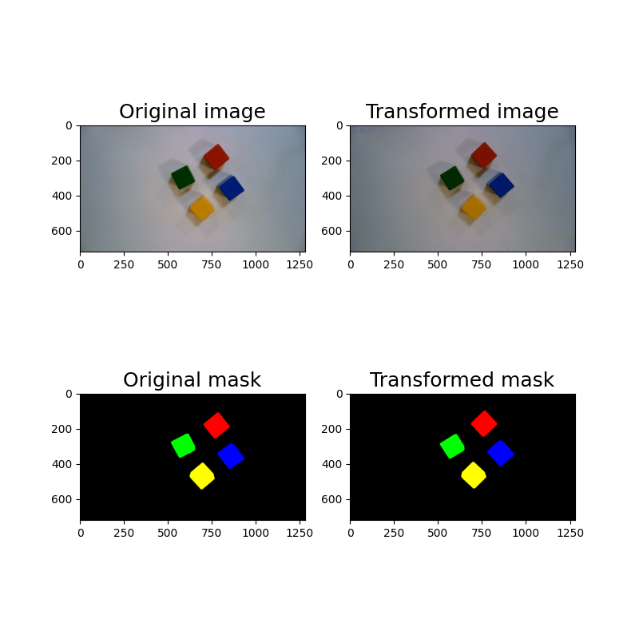

# Augmentation Images and masks

### I try augment image and mask together with Albumentations library

Albumentations link:
- https://albumentations.ai
documents of Albumentations library link:
- https://albumentations.ai/docs

#### Output of Transfomation is:

#### Transforms were used in this project:
-  GaussianBlur
- Flip
- GaussNoise
- RandomBrightnessContrast
- RandomShadow
- Sharpen
- Rotate
